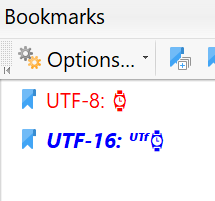
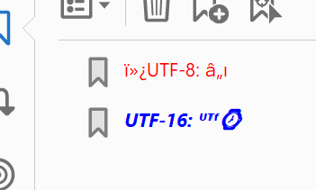

# PDF 2.0 Examples

&nbsp;&nbsp;&nbsp;

&nbsp;&nbsp;&nbsp;

&nbsp;&nbsp;&nbsp;

&nbsp;&nbsp;&nbsp;

This is a collection of example PDF 2.0 files which comply with [ISO 32000-2:2020](https://www.iso.org/standard/75839.html). The files in this collection are intended for educational purposes and are intentionally kept relatively simple. Each example illustrates the usage of a new PDF 2.0 feature.

# Contributions

We welcome your contributions of additional examples! For any files, materials, pull requests or other contributions you offer for this project: you hereby grant the PDF Association copyright to these contributions, as well as grant permission for the PDF Association to license your contributions under the same license as the other contents of this repository. The PDF Association does not request an exclusive copyright. We make this request so that we can offer your contribution under the same [Creative Commons Attribution 4.0 International Public License](LICENSE.md) we are using for the rest of these examples and materials.

# Example Files

The examples in this set include:

## 'Simple PDF 2.0 file.pdf'
This is a single page PDF that demonstrates a fairly simple set of text and path operators. The content stream for the PDF page contains comments that describe the operators being used to define the page content. This PDF includes example file metadata that you can use to see commonly provided XMP metadata fields.

## 'Simple 2.0 via incremental save.pdf'
This is an example of a PDF 1.7 file that was updated to a PDF 2.0 file. This shows how an incremental save might be used when an existing PDF 1.7 file is updated and you want to mark the PDF as a PDF 2.0 file. The page should display the string "PDF 2.0 Words have Spacing" if it is properly parsed and interpreted; a different string will display if the viewer is not capable of reading the incremental save in the file.

## 'PDF 2.0 image with BPC.pdf'
This PDF demonstrates the how to specify within a graphic state dictionary that black point compensation should be used when rendering or color converting content within a content stream. This feature is new in PDF 2.0.
This file also gives an example of specifying a calibrated RGB color space in a PDF. There are two different calibrated RGB spaces used to interpret the same image data; you should see a marked color shift between the two images on the page.

## 'PDF 2.0 UTF-8 bookmarks.pdf'
This PDF 2.0 example contains two outline items (a.k.a. bookmarks), with one encoded as UTF-16BE (supported in PDF 1.x) and the other encoded as UTF-8 (PDF 2.0). Both bookmarks should be displayed or extracted correctly without any leading garbage bytes prior to the "UTF" text in PDF Processors that support both PDF 1.x and PDF 2.0.

<TABLE ALIGN="center" BORDER=0 CELLSPACING=0 CELLPADDING=0>
<TR>
    <TD>  </TD>
    <TD>  </TD>
</TR>
<TR>
    <TD ALIGN="center"> Correct </TD>
    <TD ALIGN="center"> Incorrect </TD>
</TR>
</TABLE>

## 'PDF 2.0 UTF-8 string in annotation.pdf'
This PDF shows how to place UTF-8 Unicode encoded strings into PDF strings. The /Content entry for the annotation contains Thai language text encoded in UTF-8. The ability to encode text in UTF-8 format is new in PDF 2.0.
Note that many non-PDF 2.0 aware viewers will have problems with this example:

* The annotation content entry text will typically display erroneously, if the viewer does not support the PDF 2.0 addition for UTF-8 string encoding.

* The annotation itself may not display as a rectangle in all viewers. This is because some viewers expect the quadrilateral used for defining annotation bounds (QuadPoints) in a format different than what is described in the PDF specification. In the PDF, you'll find comments explaining the difference in forms.

## 'PDF 2.0 with offset start.pdf'
This is a very simple PDF 2.0 file. It demonstrates a PDF file that does not start at byte 0 of the file on disk. Please read the commentary at the head of the file in a text editor for additional information.

## 'PDF 2.0 with page level output intent.pdf'
This example shows how to add a page-level output intent to a PDF page, which is a new feature of PDF 2.0. This PDF has a file-level PDF/X output intent, and also has a page-level PDF/X output intent on page 1 that differs from the document-level output intent. The output intents in this PDF are RGB colorspaces for demonstration purposes: one will typically use an output intent for a CMYK condition.

# Other PDF 2.0 files

Several PDF Association members also make available sample PDF 2.0 files. These files may be non-trivial, part of a larger corpus, mixed with files from other PDF versions, or unable to be read in a text editor.

## iText

* [Various Tagged PDF examples](https://github.com/itext/itext7/tree/develop/layout/src/test/resources/com/itextpdf/layout/LayoutTaggingPdf2Test)
* [Various encryption examples](https://github.com/itext/itext7/tree/develop/kernel/src/test/resources/com/itextpdf/kernel/crypto/PdfEncryptionTest)
* [Various digital signature examples](https://github.com/itext/itext7/tree/develop/sign/src/test/resources/com/itextpdf/signatures/sign/SigningTest)

---

 This work is licensed under a <a rel="license" href="http://creativecommons.org/licenses/by/4.0/">Creative Commons Attribution 4.0 International Public License</a>.
